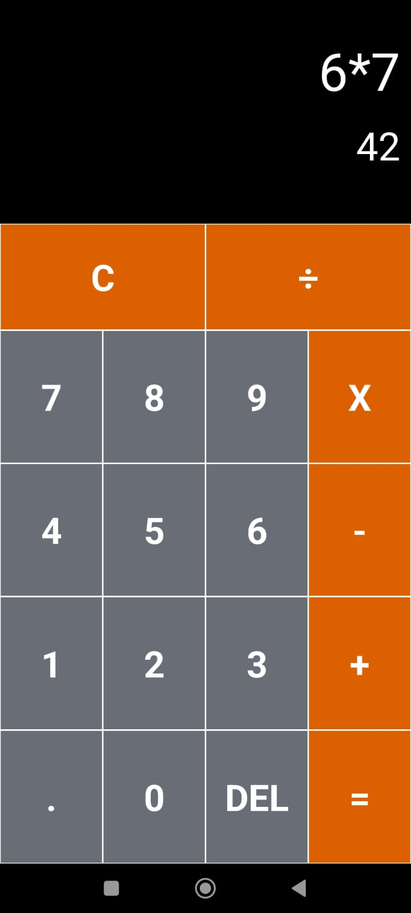
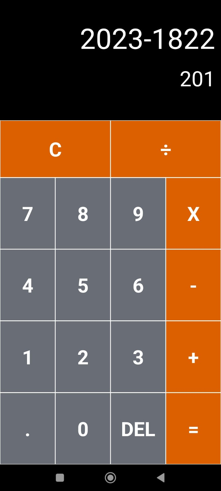

# ProjetoPosCalculadora
Projeto do curso de Pós Gradução da PUCPR - Desenvolvimento de Aplicativos Móveis. Calculadora para o Android

## Descrição:
A aplicação desenvolvida, possui  a finalidade de realizar as operações elementares, que são **SOMA**, **SUBTRAÇÃO**, **DIVISÃO** e **MULTIPLICAÇÃO**.

## Informações Técnicas:
A aplicação foi desenvolvida de forma nativa Android, utilizando a linguagem Kotlin.

## Bibliotecas usadas:
- exp4j: https://www.objecthunter.net/exp4j/

## Imagens:

